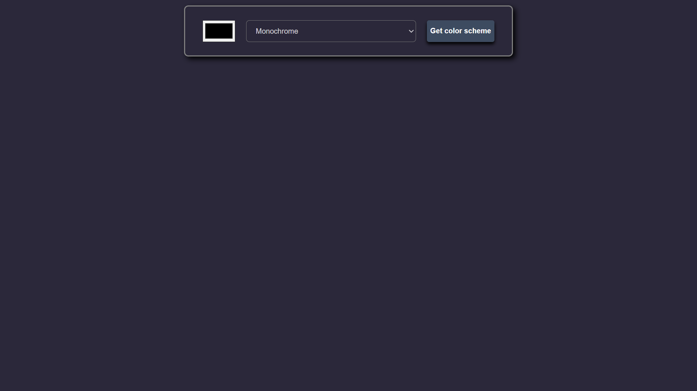
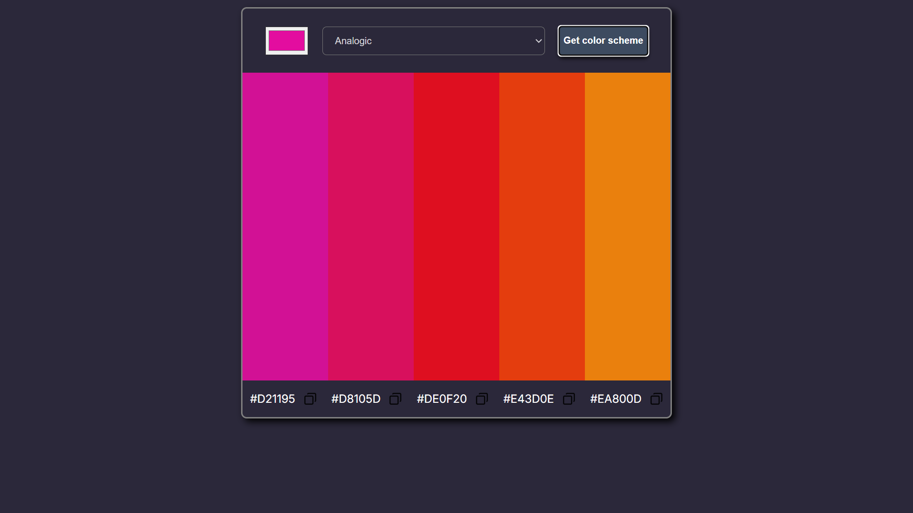

# Color Scheme Generator 🎨

A simple web app that generates beautiful color schemes using The Color API.

## Features

- Select a seed color
- Choose different color scheme modes
- Generate matching color palettes
- Display hex color values
- Copy hex values to clipboard

## Technologies Used

- HTML
- CSS
- JavaScript
- The Color API

## How It Works

1. Select a color using the color picker
2. Choose a color scheme mode
3. Click the "Get Color Scheme" button
4. The app fetches matching colors from The Color API
5. Generated colors and hex values are displayed on the screen

## API Used

https://www.thecolorapi.com/

## Screenshot

This project generates color schemes and palettes.

### Color Scheme

### Color Scheme Palette

## 🚀 Live Demo

You can try the project here:  
[Color Scheme Generator](https://patel-color-scheme-generator.netlify.app/)
